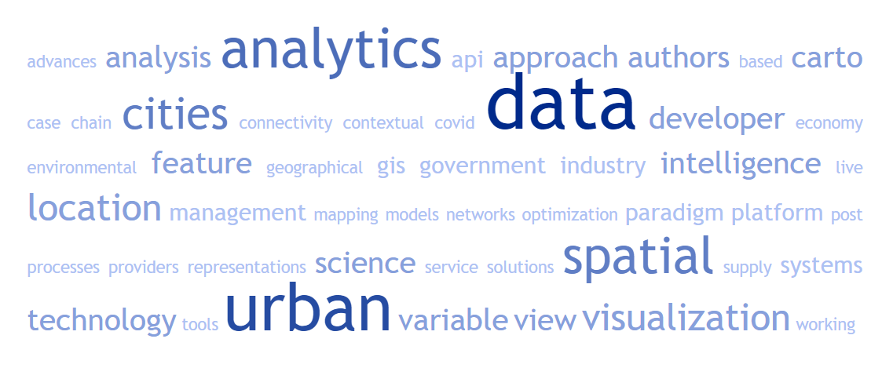

## Our agenda today!!!!

1. Vocabulary
2. Self-assessment of prior knowledge
3. Mind-map - Urban analytics
4. Classroom activity

---
## Learning objectives

By the end of this lesson students will understand:   

1. There are many types of data collected within urban contexts.   
2. Data can record activity, attributes and dynamics over a range of spatio-temporal scales.    
3. Data can be generated organizally or through purposeful data collection processes.   
4. Sensors and social media complement tradicional sources and are generating and increasing amount of new data about urban areas.    
5. Planning support systems can have different approaches.   

---
## Vocabulary

--- &submitcompare1

## What is Urban Analytics?

What comes in mind as a quick definition of **Urban Analytics**?

*** .explanation

"Urban Analytics is the practice of using new forms of data in combination with computational approaches to gain insight into urban processes." (Singleton et al., 2018)

--- &submitcompare1

## Urban Analytics and Decision Making: how do they relate?

How can you relate, from your previous knowledge, **Urban Analytics** and **Decision Process**?

*** .explanation

Urban analytics can subsidize strategic planning through insightful data to help determining constraints, possibilities and support optimal decisions. Also, data can empower citizens to make better decisions concerning the city use, mobility, engagement and other urban life demands.   

---
## Urban Analytics

---
## Group activity

1. What is the difference between organic and purposeful data generation? Illustrate de discussion with examples, and consider the advantages and disadvantages of these two approaches. 

2. Compare and contrast the use of social media versus survey data to investigate an urban issue of your groups' choice. Remember that this is the first activity concerning the final project. 

Students need to submit (Canvas) a short and objective report (up to 800 words) answering the proposed questions. This report will be discussed in class, among students, in our next meeting. The discussion will be oriented to let colegues contribute with the development of a final project that stars with question 2.  
